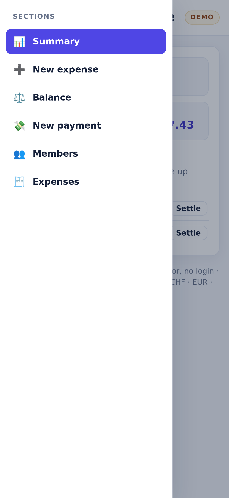
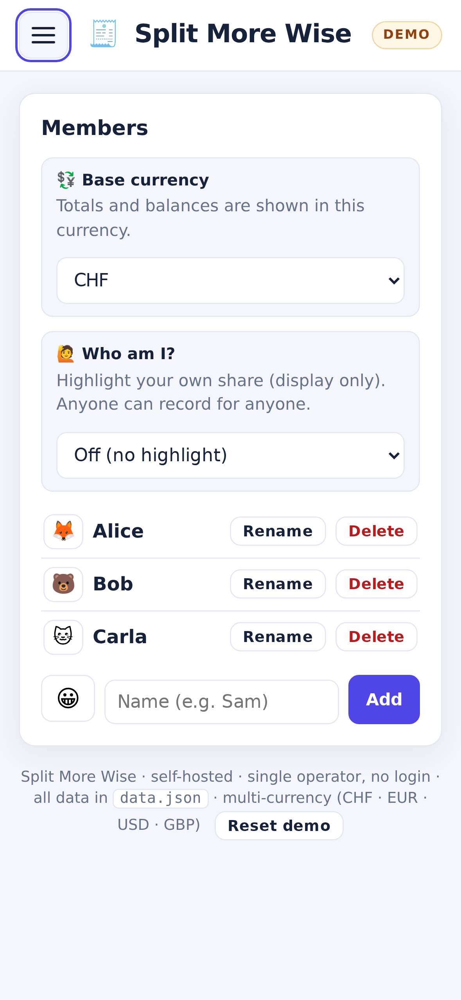
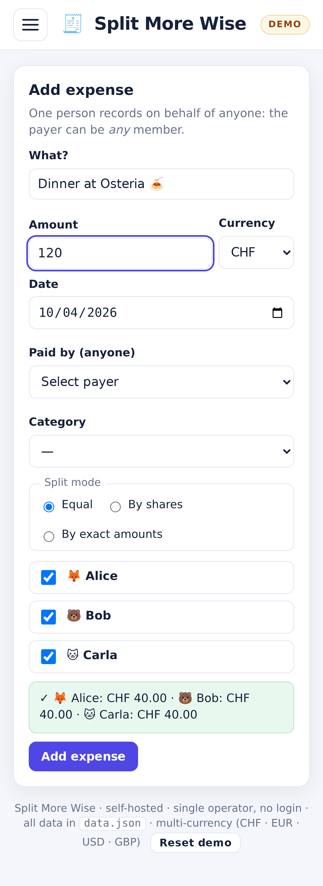
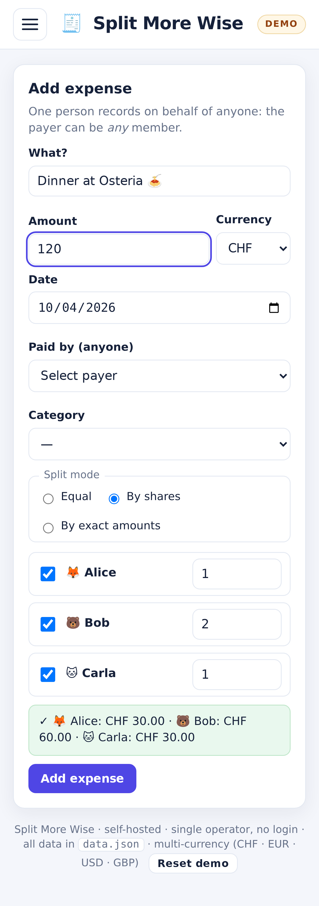
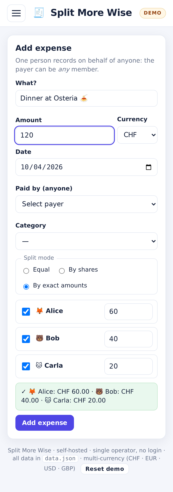
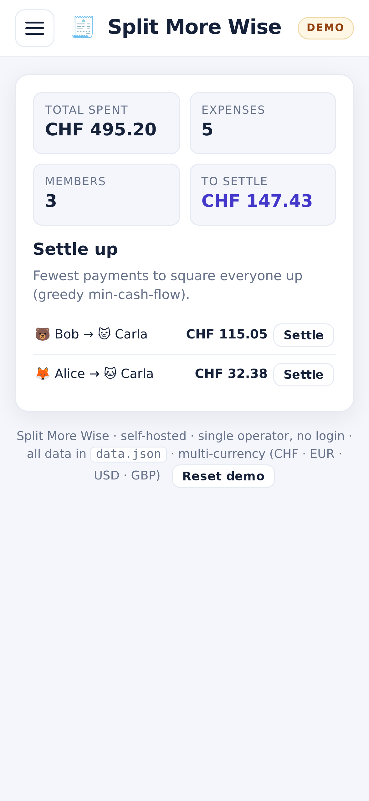
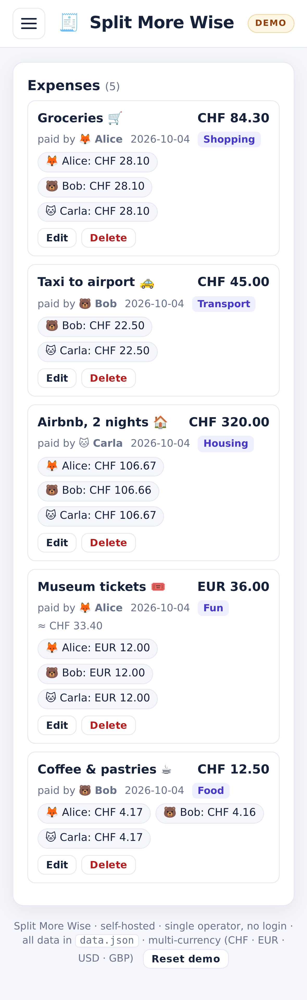

# Split More Wise

A **self-hosted** group expense splitter (a mini Splitwise) built around a **single-operator**
model: one person uses the app and can record expenses **on behalf of anyone** in the group.

- The **payer can be any member**, not just the operator.
- **Participants can be any subset** of members.
- **Self-hosted**: run it yourself (locally, in Docker, on a VPS, or on Render). All data
  stays on your own server; there is no third-party backend.
- No login, no accounts, no multi-user auth. It is a single-operator tool.
- Zero npm dependencies: the backend uses only the Node.js standard library.
- The frontend is vanilla HTML, CSS and JavaScript. No frameworks, no CDN, no build step.
  It works offline; only the multi-currency exchange-rate lookup needs network.
- Multi-currency (CHF, EUR, USD, GBP) with ECB reference rates.

**Live demo:** <https://split-more-wise.onrender.com> (public demo with sample data, resets every 30 minutes).

## Table of contents

- [Overview](#overview)
- [Screenshots](#screenshots)
- [Features](#features)
- [Tech stack](#tech-stack)
- [Requirements](#requirements)
- [Getting started](#getting-started)
- [Configuration](#configuration)
- [Deploy](#deploy)
- [REST API](#rest-api)
- [Data model](#data-model)
- [Project structure](#project-structure)
- [Design notes](#design-notes)
- [License](#license)

## Overview

Split More Wise keeps track of who paid for what in a small group and computes who owes whom.
Because it is designed for a single operator, the person using the app can enter an
expense that was paid by a friend and shared among several people, which makes it a fast
way to keep a shared ledger without asking everyone to install anything.

All state lives in a single JSON file next to the server. Starting the server with no
data file seeds a small example group so the interface is immediately usable.

## Screenshots

All screenshots use the mobile layout, emulated on an iPhone 14 Pro (393 x 852 viewport,
3x device pixel ratio, mobile user agent and touch input).

Navigation menu and the Members view (base currency and "Who am I"):

| Menu | Members |
|---|---|
|  |  |

Adding an expense, with the live split preview for each split mode:

| Equal | By shares | By exact amounts |
|---|---|---|
|  |  |  |

Settle-up pre-fill and the expense list:

| Settle up | Expenses |
|---|---|
|  |  |

## Features

1. **Navigation**: a burger menu switches between the sections (Summary, New expense,
   Balance, New payment, Members, Expenses); only one is shown at a time. The choice is
   remembered across reloads.
2. **Members**: add, rename and delete members. A member cannot be deleted while it is
   referenced by an expense or a settlement (the API returns `409`). The member list
   shows each person's current balance.
3. **Add an expense**: description, amount and currency (CHF/EUR/USD/GBP), date (defaults
   to today), a payer dropdown with **any** member, participant checkboxes, and three split modes:
   - equal,
   - by shares,
   - by exact amounts.

   A live preview shows each person's share (and, for a foreign currency, the converted
   total), and the split is validated so that the shares always sum to the total.
4. **Expense list**: newest first, with description, amount, payer, per-person shares and
   category, plus edit and delete. Foreign-currency expenses show the original amount and
   the equivalent in the base currency.
5. **Balances**: net balance per member (positive means the person is owed money,
   negative means the person owes money), together with a **who owes whom** settle-up
   list computed with a greedy min-cash-flow algorithm (repeatedly matching the largest
   debtor with the largest creditor).
6. **Settlements (payments)**: record a direct repayment between two members (in the base
   currency), which adjusts the balances. Payments are listed newest first and can be deleted.
7. **Dashboard (Summary)**: four tiles (total spent, number of expenses, number of members,
   and the total still **to settle**), plus the settle-up suggestions with a one-click
   **Settle** pre-fill. Amounts are shown in the base currency.
8. **Who am I** selector (optional, in the Members view): a pure display highlight stored in
   `localStorage`. It never restricts who can record what.
9. **Multi-currency**: pick the **base currency** (CHF/EUR/USD/GBP) in the Members view; the
   summary total and the settle-up are shown in it. Each expense can be recorded in any
   supported currency and is converted to the base currency at the **ECB reference rate for
   the expense date** (via [Frankfurter](https://frankfurter.dev), no API key). Rates are
   cached per day in the data file. The original amount is kept and shown on the expense.
   Changing the base currency re-converts everything instantly: rates are derived from a
   single CHF-based table, so nothing is rewritten.

## Tech stack

- **Backend**: Node.js standard library only (`node:http`, `node:fs`, `node:path`,
  `node:crypto`). No web framework, no dependencies.
- **Frontend**: vanilla HTML, CSS and JavaScript. No framework, no bundler, no CDN.
- **Persistence**: pluggable store (`store.js`). By default a single JSON file, written
  atomically; alternatively an Upstash-compatible Redis (KV) store when the KV env vars are set.

## Requirements

- Node.js 18 or newer (developed and tested on Node 24).
- Any modern browser.

## Getting started

```bash
node server.js
```

Then open <http://localhost:11000/>.

To run it in the background:

```bash
nohup node server.js > server.log 2>&1 &
```

## Configuration

Everything is configured through environment variables.

| Variable | Default | Description |
|---|---|---|
| `PORT` | `11000` | TCP port the server listens on. |
| `DATA_FILE` | `./data.json` | Path of the JSON state file (file storage). |
| `DATA_DIR` | `.` | Directory for `data.json` when `DATA_FILE` is not set. Useful with a mounted disk. |
| `UPSTASH_REDIS_REST_URL` | _(unset)_ | With the token below, keep the state in a Redis (KV) store instead of a file. |
| `UPSTASH_REDIS_REST_TOKEN` | _(unset)_ | Token for the KV store above. |
| `DATA_KEY` | `split-more-wise:state` | Key used inside the KV store. |
| `DEMO` | _(off)_ | `1`/`true` enables demo mode: sample data on boot, a DEMO badge, a "Reset demo" button and `POST /api/demo/reset`. |
| `DEMO_RESET_MINUTES` | `0` | In demo mode, auto-reset the data every N minutes (`0` = never). |

The server binds to `0.0.0.0`, so it is reachable from the local network. Because there is
no authentication, only expose it on trusted networks, or run it in demo mode.

## Deploy

The app has no dependencies and reads `PORT`, so it runs on any Node host. The only real
question is where the state lives.

**Quickest path to a public demo (Render).** Use the included `render.yaml` blueprint: it
creates a free Node web service with `DEMO=1` and `DEMO_RESET_MINUTES=30`. On the free plan
the filesystem is ephemeral, which for a demo is a feature: the data resets on every
restart/deploy and every 30 minutes, so the demo stays clean and self-healing.

**Persistence options.**

- **Disk (Render Disk, Fly volume, any VPS):** mount a disk and set `DATA_DIR` to the mount
  path (for example `DATA_DIR=/data`). The file storage then keeps the data across restarts.
- **KV store (Upstash Redis):** set `UPSTASH_REDIS_REST_URL` and `UPSTASH_REDIS_REST_TOKEN`.
  The whole state is stored as one JSON value, so the app also runs on serverless platforms
  with no filesystem (Vercel, Netlify functions, Cloudflare Workers via the Upstash
  integration). The Upstash free tier is plenty for this app.

**Docker.**

```bash
docker build -t split-more-wise .
docker run -p 11000:11000 -e DEMO=1 split-more-wise
```

**A note on auth.** There is no login, by design. A public demo is fine: demo mode seeds
disposable data and offers a reset. For real personal data, keep it on a private network or
behind a reverse proxy with authentication.

## REST API

All endpoints speak JSON. Errors return a JSON body with an `error` field and an
appropriate HTTP status code.

| Method | Path | Description |
|---|---|---|
| `GET` / `POST` | `/api/members` | List members / create one (`{name, emoji?}`) |
| `PATCH` / `DELETE` | `/api/members/:id` | Rename / delete a member (`409` if referenced) |
| `GET` / `POST` | `/api/expenses` | List expenses (newest first) / create one |
| `PATCH` / `DELETE` | `/api/expenses/:id` | Update / delete an expense |
| `GET` / `POST` | `/api/settlements` | List settlements (newest first) / create one |
| `DELETE` | `/api/settlements/:id` | Delete a settlement |
| `GET` | `/api/summary` | `{ balances, settleUp, totalSpent, baseCurrency }` (amounts in base currency) |
| `GET` | `/api/state` | Full state: `{ members, expenses, settlements, settings }`; each expense carries a derived `amountBase` and `fx` |
| `GET` | `/api/fx?from=&to=&date=` | Exchange rate for a date: `{ from, to, date, rate, rateDate }` |
| `PUT` | `/api/settings` | Update settings, e.g. `{ baseCurrency }` |
| `GET` | `/` | Static frontend served from `public/` |

## Data model

Expense:

```json
{
  "id": "uuid",
  "description": "Groceries",
  "amount": 42.5,
  "currency": "CHF",
  "date": "2026-10-03",
  "paidBy": "<memberId>",
  "split": [{ "memberId": "<memberId>", "share": 21.25 }],
  "category": "Food",
  "createdAt": "2026-10-03T12:00:00.000Z"
}
```

Settlement:

```json
{
  "id": "uuid",
  "from": "<memberId that pays>",
  "to": "<memberId that receives>",
  "amount": 20,
  "date": "2026-10-03",
  "note": "Twint",
  "createdAt": "2026-10-03T12:00:00.000Z"
}
```

Amounts are entered in major units (for example `12.50` CHF) in the expense's currency. All arithmetic
is performed in **integer cents** to avoid floating point drift; any rounding remainder is assigned to
the first participant and the behaviour is mirrored on both client and server. `currency` is one of
`CHF`, `EUR`, `USD`, `GBP`. Amounts are converted to the group's base currency (`settings.baseCurrency`)
using the ECB rate for the expense date; reads from `/api/state` also include a derived `amountBase`
and `fx` object. The rate tables live under `fx.days` (one CHF-based table per date).

## Project structure

```
.
├── server.js            # HTTP server, router, API and static file handling
├── store.js             # Storage abstraction: file (default) or Upstash-compatible KV
├── public/
│   ├── index.html       # Single-page application shell
│   ├── app.js           # Frontend logic (vanilla JS)
│   └── styles.css       # Styling
├── data.json            # Persisted store (created and seeded on first run)
├── Dockerfile           # Zero-dependency image
├── render.yaml          # Render blueprint (public demo)
├── package.json
├── LICENSE
└── README.md
```

## Design notes

- **Atomic writes**: `data.json` is written to a temporary file and then renamed, so a
  crash mid-write cannot corrupt the store.
- **Integer cents**: money is never handled as a binary float during calculations.
- **Greedy settle-up**: the suggested payments minimise the number of transfers needed to
  square everyone up, without claiming to be the unique optimal solution.

## License

Released under the MIT License. See [LICENSE](LICENSE).
